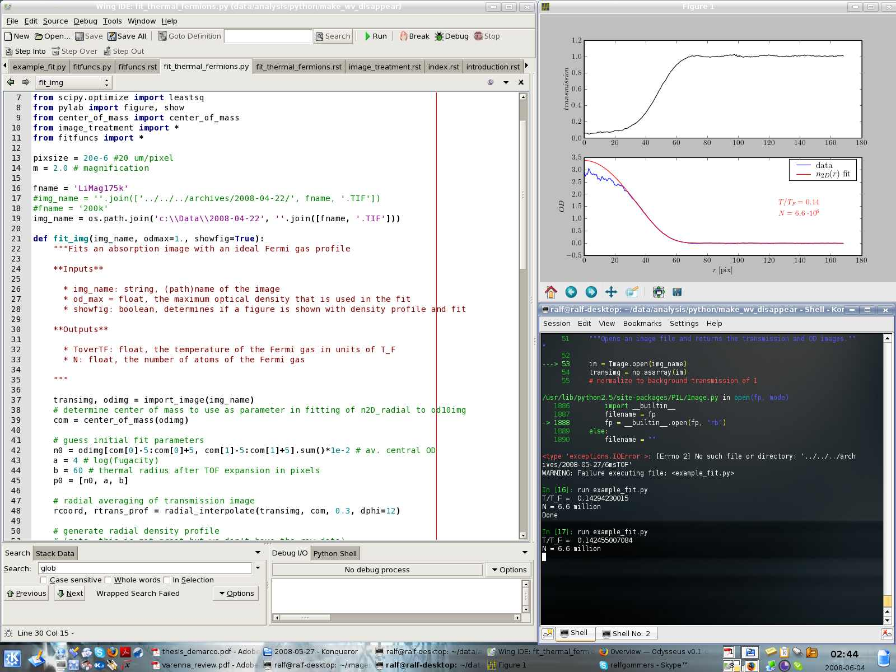

Introduction
============

This is the documentation for Odysseus, the fitting program for Fermionic cold atom clouds. 

Prerequisites
-------------

Odysseus is written in `Python <http://python.org>`_ and requires a few Python libraries to run. The most important ones are `Numpy <http://scipy.org/NumPy>`_ (for fast numerics), `Scipy <http://scipy.org/>`_ (for fitting routines etc) and `Matplotlib <http://matplotlib.sourceforge.net/>`_ (for plotting). On Windows, a fully functional environment can be obtained simply by installing the `Enthought Python Distribution <http://enthought.com/products/epd.php>`_ (EPD). `Sage <http://www.sagemath.org/>`_ should work as well, but this has not yet been tested. On Linux, all libraries can be installed through the package manager on the most common distributions.

Work environment
----------------

The most efficient way of using Odysseus is to write small scripts, that define the image(s) you want to fit, and then to run these scripts from the command line. Standard Python works fine, but nicer is to use the `IPython <http://ipython.scipy.org/moin/>`_ interpreter. IPython and a nice editor of your choice can be used in the same way as you would use Matlab for interactive data analysis. A typical interactive session looks like this:

In order to be able to run data analysis scripts from any directory, it is essential that the Python interpreter knows where to find the Odysseus modules. This requires setting the environment variable PYTHONPATH to include the Odysseus directory. For Windows XP this can be done via *My Computer > Properties > Advanced (tab) > Environment Variables* and on Linux by defining PYTHONPATH in a shell startup rc file (.bashrc for example). To make sure this worked you can type ``echo $PYTHONPATH`` in a terminal.

Fitting an image
----------------

Once everything is set up we can test if it all works. To do this we need the example script below and an image. Both can be found in the Odysseus source directory.

.. code-block:: python
   :linenos:
   
   import os
   from fit_thermal_fermions import fit_img

   #dirname = '../../../archives/2008-05-27/'
   dirname = 'c:\\Data\\2008-05-27'

   ## this is how to fit a single image ##
   fname = '6msTOF.TIF'
   img_name = os.path.join(dirname, fname)
   fit_img(img_name, odmax=1.2, showfig=True)

Open a terminal, go to the Odysseus source directory and start ipython there (simply type "ipython -pylab" at the promt and press enter. Then run the script by typing "run example_fit.py".

How to get good results
-----------------------

There are some things to keep in mind when you want a reliable temperature fit. First of all, it is very important that the image is as clean as possible (few fringes). This can be achieved by cleaning optical surfaces, by aperturing the imaging beam to limit backreflections, by angling optical surfaces, and by using a short optical path length after the imaging fiber.

Other things that can be done are:

- use ROI with size at least two or three times the cloud size (otherwise we get normalization errors, or cut off significant parts of the data)
- for ROI, stay away from regions with no light and image edge by at least 20 pixels
- use images with a central OD between ~ 1 and 2.8
- results are not sensitive to TOF or cutoff OD when the above is done (check!)